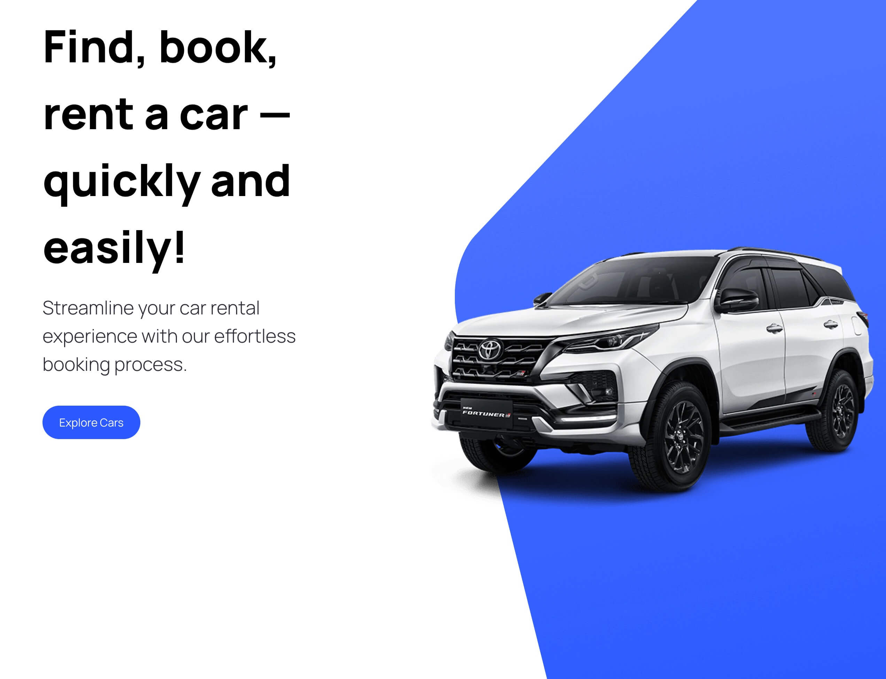

# Carhub

CarHub connects users to a comprehensive database of popular car manufacturers, offering detailed information on each vehicle model. It's a modern JAMstack application, built with Next.js, it leverages two distinct APIs: one from RapidAPI for retrieving all the car details, and another from imagin.studio for fetching high-quality, AI-generated car images. This project provided an excellent opportunity for me to explore the newest features of Next.js 13, such as the server components, which play a central role in CarHub's design. Additionally, this is my first project where I dabble with TypeScript. I've found it to be an great tool for improving the development experience, particularly due to its robust error reporting, autocompletion & code hints. It also naturally enhances code documentation, making my code clearer and more maintainable.

[Carhub](https://carhub-moro4.vercel.app/)